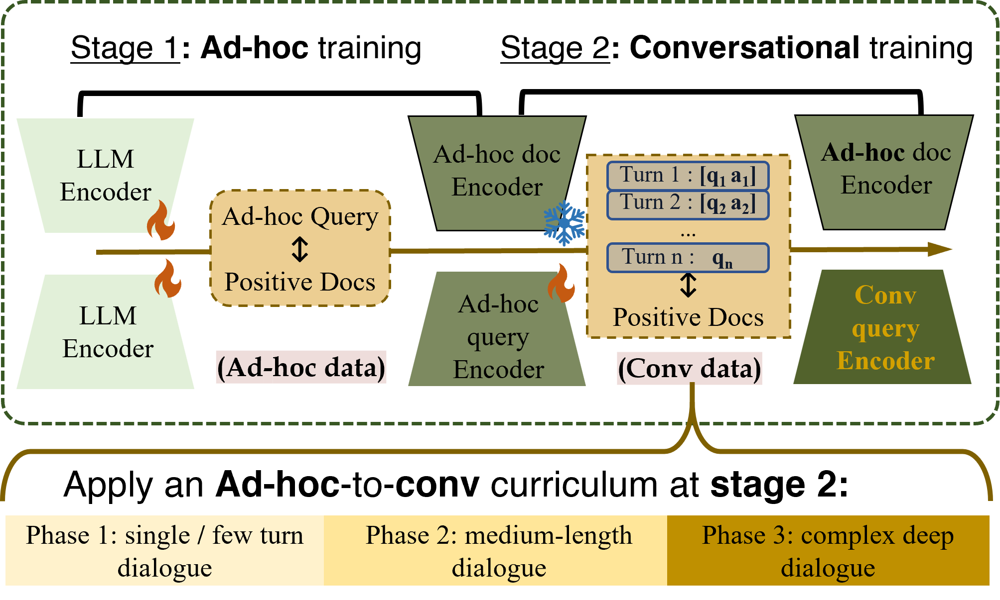

<p align="center">
  
</p>

# Continual Learning for Conversational IR

[](https://creativecommons.org/licenses/by-nc/4.0/)

Code repository for UdeM course IFT 6167 Continual Learning.

We study how to fine-tune a dense retrieval query encoder (ANCE / Qwen3-Embedding) from ad-hoc search to conversational search (TopiOCQA), while retaining performance on the original ad-hoc task (MSMARCO, BEIR). Two strategies are explored:

- **Experience Replay (ER)**: mix TopiOCQA training samples with a replay buffer of MSMARCO samples at each gradient step.
- **Curriculum Learning (CL)**: order TopiOCQA training by conversation difficulty (turn length), progressing from single-turn to multi-turn dialogues, with or without experience replay.

---

## Environment Setup

```bash
# Create and activate conda environment
conda create -p /path/to/your/env python=3.12
conda activate /path/to/your/env

# PyTorch (CUDA 12.1)
conda install pytorch torchvision torchaudio pytorch-cuda=12.1 -c pytorch -c nvidia

# FAISS for dense retrieval index
conda install -c conda-forge faiss-gpu

# Python dependencies
pip install -r requirements.txt

# Flash Attention 2 (requires Ampere or newer GPU)
pip install flash-attn --no-build-isolation
```

---

## Data Preparation

### TopiOCQA

```bash
# 1. Download the Wikipedia corpus (27 parquet shards, ~30 GB)
cd preprocess/
bash download_topiocqa.sh

# 2. Merge parquets to a single .tsv collection
python merge_parquets_to_tsv.py

# 3. Download gold train/dev splits from the official TopiOCQA repo
#    https://github.com/McGill-NLP/topiocqa
#    gold_train.json, gold_dev.json

# 4. Preprocess into training/eval files
python preprocess_topiocqa.py
# Outputs:
#   topiocqa_train_oracle.jsonl   — training set with oracle utterances
#   topiocqa_valid.jsonl          — validation set
#   topiocqa_qrel.trec            — TREC-format qrels for validation
```

### MSMARCO (for Experience Replay)

```bash
cd preprocess/
bash download_msmarco_train.sh
python preprocess_msmarco.py
```

---

## Corpus Indexing

Encode the TopiOCQA Wikipedia corpus into dense embeddings using multi-GPU distributed indexing.

### ANCE (RoBERTa-base, 768-dim)

```bash
cd index/
torchrun --nproc_per_node 4 distributed_dense_index.py \
  --model_type ance \
  --pretrained_doc_encoder_path <path_to_ance_msmarco_checkpoint> \
  --collection_path <path_to_topiocqa_collection.tsv> \
  --output_index_dir_path <output_dir/topiocqa_ance_unmerged> \
  --per_gpu_index_batch_size 700 \
  --num_docs_per_block 1000000 \
  --max_doc_length 256 \
  --n_gpu 4
```

### Qwen3-Embedding-0.6B (1024-dim)

Same command with `--model_type qwen3` and `--embed_dim 1024`. The encoder uses last-token pooling with left-padding; `--use_flash_attention --use_bf16` are recommended for speed.

### Merging index shards

Distributed indexing produces per-rank, per-block shards (`doc_emb_block.rank_R.B.pb`). Merge them into per-block files for use in training:

```bash
python preprocess/merge_qwen_corpus.py \
  --input_dir  <output_dir/topiocqa_qwen_unmerged> \
  --output_dir <output_dir/topiocqa_qwen_merged> \
  --embed_dim 1024 \
  --n_ranks 4
```

---

## Pre-computing Positive/Negative Embeddings

The training scripts use pre-computed embeddings for positive and negative documents to avoid re-encoding the corpus at each step.

### ANCE

```bash
torchrun --nproc_per_node 4 src/encode_pos_neg_docs_batched.py \
  --encoder_path <path_to_ance_checkpoint> \
  --dataset_file <topiocqa_train_oracle.jsonl> \
  --output_file  <embeddings/topiocqa_pos_neg_docs_ance/embeddings.pt> \
  --max_doc_length 256
```

### Qwen3-Embedding-0.6B

Positive/negative embeddings are extracted directly from the merged corpus index (no re-encoding needed):

```bash
python preprocess/extract_qwen_pos_neg_from_corpus.py \
  --train_file    <topiocqa_train_oracle.jsonl> \
  --corpus_dir    <topiocqa_qwen_merged/> \
  --encoder_path  <path_to_qwen3_embedding_0.6B> \
  --output_file   <embeddings/topiocqa_pos_neg_docs_qwen/embeddings.pt> \
  --embed_dim 1024
# Output: ~560 MB, 45450 keys, each with {pos, neg, oracle} vectors of shape (1024,)
```

---

## Training

All training scripts use `torchrun` for multi-GPU DDP. Logs and W&B metrics are written per run.

### 1. Experience Replay (ANCE)

Fine-tune ANCE on TopiOCQA while replaying MSMARCO samples to prevent forgetting.

```bash
bash src/train_continually_ddp.sh
```

Key arguments in the script:

| Argument | Description |
|---|---|
| `--per_gpu_train_batch_size` | TopiOCQA samples per GPU per step |
| `--experience_replay_batch_size` | MSMARCO replay samples per GPU per step |
| `--loss_type ranking` | Ranking loss (in-batch negatives) |
| `--negative_type none` | No hard negatives (use in-batch only) |
| `--activate_eval_while_training` | Inline BEIR eval after each epoch |
| `--beir_datasets climate-fever msmarco` | Datasets for inline BEIR eval |

The script runs a grid search over different TopiOCQA / replay batch-size splits. To run a single configuration:

```bash
torchrun --nproc_per_node 4 src/train_continually_ddp.py \
  --n_gpu 4 \
  --pretrained_encoder_path <ance_checkpoint> \
  --training_data_file      <topiocqa_train_oracle.jsonl> \
  --pos_neg_embedding_file  <embeddings.pt> \
  --msmarco_data_file       <msmarco_train.jsonl> \
  --msmarco_embedding_file  <msmarco_embeddings.pt> \
  --model_output_path       <output_dir> \
  --per_gpu_train_batch_size 60 \
  --experience_replay_batch_size 60 \
  --num_train_epochs 15 \
  --learning_rate 1e-5 \
  --warmup_ratio 0.06 \
  --loss_type ranking \
  --negative_type none \
  --activate_eval_while_training \
  --beir_datasets climate-fever msmarco \
  --eval_batch_size 64 \
  --use_gpu_faiss \
  --save_to_wandb \
  --wandb_project continual_ir \
  --wandb_name my_run
```

---

### 2. Curriculum Learning — ANCE

Fine-tune ANCE on TopiOCQA with curriculum ordering by conversation turn length (easy = 1-turn, hard = multi-turn). Controlled by `CURRICULUM_TYPE` and `PACING_FUNCTION`.

```bash
# Easy-to-hard curriculum with root_2 pacing
CURRICULUM_TYPE=easy2hard PACING_FUNCTION=root_2 bash src/train_continually_ddp_cl.sh

# Anti-curriculum (hard-to-easy)
CURRICULUM_TYPE=hard2easy PACING_FUNCTION=root_2 bash src/train_continually_ddp_cl.sh

# Ablation: no curriculum (standard random training)
CURRICULUM_TYPE=none bash src/train_continually_ddp_cl.sh
```

Or directly:

```bash
torchrun --nproc_per_node 4 src/train_continually_ddp_cl.py \
  --n_gpu 4 \
  --pretrained_encoder_path <ance_checkpoint> \
  --training_data_file      <topiocqa_train_oracle.jsonl> \
  --pos_neg_embedding_file  <embeddings.pt> \
  --model_output_path       <output_dir> \
  --num_train_epochs 20 \
  --per_gpu_train_batch_size 120 \
  --learning_rate 1e-5 \
  --warmup_ratio 0.06 \
  --loss_type ranking \
  --negative_type none \
  --curriculum_type easy2hard \
  --scoring_function turn_length \
  --pacing_function root_2 \
  --curriculum_c0 0.2 \
  --curriculum_end_epoch 16 \
  --activate_eval_while_training \
  --activate_eval_topiocqa_while_training \
  --beir_datasets climate-fever msmarco \
  --eval_batch_size 64 \
  --use_gpu_faiss \
  --use_flash_attention --use_bf16 \
  --save_to_wandb \
  --wandb_project topiocqa-ance \
  --wandb_name my_run
```

**Curriculum arguments:**

| Argument | Values | Description |
|---|---|---|
| `--curriculum_type` | `none` / `easy2hard` / `hard2easy` | Training order. `none` = standard random. |
| `--scoring_function` | `turn_length` | Difficulty metric. `turn_length = 1 + len(history) // 2`. |
| `--pacing_function` | see table below | Controls how fast new difficulty levels are introduced. |
| `--curriculum_c0` | float, e.g. `0.2` | Initial fraction of data exposed at epoch 0. |
| `--curriculum_end_epoch` | int, e.g. `16` | Epoch at which full data is reached (for cumulative pacings). |

**Available pacing functions:**

| Name | Behaviour | Formula |
|---|---|---|
| `root_2` | Fast start, slows near full data | `(x(1−c₀²)/t + c₀²)^0.5` |
| `root_5` | Slower initial warm-up | `(x(1−c₀⁵)/t + c₀⁵)^0.2` |
| `linear` | Uniform increase c₀ → 1.0 | `x(1−c₀)/t + c₀` |
| `step` | Coarse 3-stage cumulative (c₀ → mid → 1.0) | step at 33% and 66% of curriculum |
| `step_exclusive` | Each stage trains on one slice only | stage 1: [0, c₀), stage 2: [c₀, mid), stage 3: [mid, 1.0) |
| `step_exclusive_2_full` | Exclusive stages + full-data consolidation | same as above, then [0, 1.0) after `curriculum_end_epoch` |

---

### 3. Curriculum Learning — Qwen3-Embedding-0.6B

Same curriculum study repeated with a stronger encoder (1024-dim, last-token pooling, FlashAttention 2, bf16). Uses `src/train_qwen_cl.py`.

**Run the 4 experiments on one machine:**

```bash
bash scripts/run_qwen_8_experiments.sh
```

This script serially runs: `qwen_nosched` (baseline), `qwen_cl_step`, `qwen_cl_step_excl`, `qwen_cl_step_excl_2_full`.

**Key differences from ANCE training:**

| Setting | ANCE | Qwen3-0.6B |
|---|---|---|
| Encoder | RoBERTa-base (768-dim) | Qwen3-Embedding-0.6B (1024-dim) |
| Pooling | `[CLS]` token | Last token (left-padded) |
| Precision | bf16 + tf32 | bf16 |
| Flash Attention | optional | required (`--use_flash_attention`) |
| `--encoder_type` | *(default)* | `qwen3` |
| `--embed_dim` | 768 | 1024 |
| BEIR GPU caching | `--keep_faiss_on_gpu` | always off (1024-dim BEIR + TopiOCQA indices exceed GPU memory) |

Direct invocation:

```bash
torchrun --nproc_per_node 4 src/train_qwen_cl.py \
  --pretrained_encoder_path <qwen3_embedding_0.6B_path> \
  --training_data_file      <topiocqa_train_oracle.jsonl> \
  --pos_neg_embedding_file  <topiocqa_pos_neg_docs_qwen/embeddings.pt> \
  --topiocqa_embedding_dir  <topiocqa_qwen_merged/> \
  --topiocqa_valid_file     <topiocqa_valid.jsonl> \
  --topiocqa_qrel_file      <topiocqa_qrel.trec> \
  --model_output_path       <output_dir> \
  --num_train_epochs 20 \
  --per_gpu_train_batch_size 120 \
  --learning_rate 1e-5 \
  --warmup_ratio 0.06 \
  --no_lr_schedule \
  --loss_type ranking \
  --negative_type none \
  --curriculum_type easy2hard \
  --pacing_function root_2 \
  --curriculum_c0 0.2 \
  --curriculum_end_epoch 16 \
  --embed_dim 1024 \
  --encoder_type qwen3 \
  --use_flash_attention --use_bf16 --gradient_checkpointing \
  --activate_eval_topiocqa_while_training \
  --activate_eval_while_training \
  --beir_datasets climate-fever msmarco \
  --eval_batch_size 64 \
  --use_gpu_faiss \
  --n_gpu 4 \
  --save_to_wandb \
  --wandb_project topiocqa-qwen \
  --wandb_name my_run
```

---

## Evaluation

Evaluation runs inline at the end of each training epoch. Results are logged to W&B under:

- `eval/topiocqa_MRR@10`, `eval/topiocqa_NDCG@10`, `eval/topiocqa_Recall@100` — per-epoch TopiOCQA
- `eval/{dataset}_ndcg@10` — per-epoch BEIR (intermediate epochs)
- `final/topiocqa/{metric}` — full metrics at final epoch
- `final/{dataset}/{metric}` — full BEIR metrics at final epoch

To run standalone evaluation on a saved checkpoint, use `src/test_ConvMix.py`.

---

## License

This work is licensed under a [Creative Commons Attribution-NonCommercial 4.0 International License](https://creativecommons.org/licenses/by-nc/4.0/).
